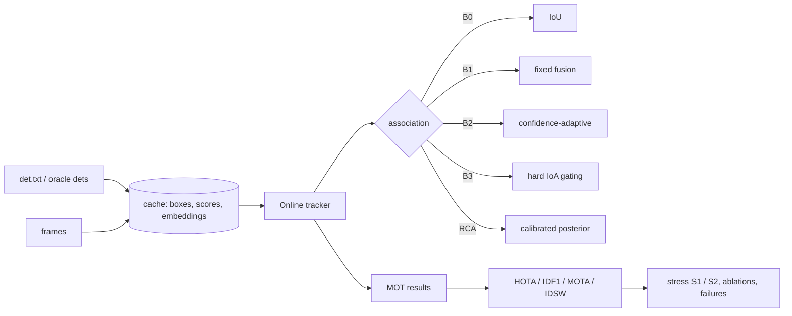
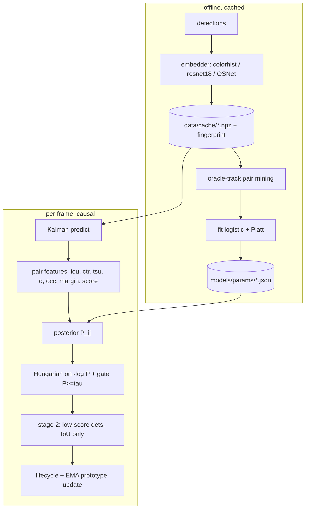

# reliability-calibrated-mot

**Calibrated, ambiguity-aware motion/appearance association for online multi-person tracking under occlusion**
(Zed Digital problem statement PS-2), built on a from-scratch ByteTrack-style tracker and evaluated with HOTA / IDF1 /
MOTA / ID-switches on MOT17, MOT20 and DanceTrack, plus controlled stress tests.

> **Status of the numbers.** Everything in the *results* section is generated by the code from real runs.
> Synthetic DEMO results are a smoke test of the whole pipeline on locally rendered scenes — **they are not a benchmark**.
> Benchmark rows read `NOT YET RUN` until you download the datasets and run `scripts/reproduce.py --full`.

---

## 1. Project overview

An online (causal) multi-object tracker whose data-association cost is a **learned, calibrated match posterior**
instead of a hand-weighted sum of motion and appearance. Everything shared with existing trackers (Kalman filter,
Hungarian assignment, two-stage association, lifecycle) is implemented here from scratch so that baselines and the
proposed method differ in *one* place only: the association decision.



## 2. Original Zed Digital problem statement (PS-2)

*Identity-Preserving Multi-Object Tracking through Dense Occlusion.*
**Context:** in a crowded gate, people occlude one another constantly; tracks are frequently lost and re-created,
causing ID switches. **Problem:** design a real-time multi-object tracking algorithm that maintains a stable identity per
person through mutual occlusion and short disappearances, and correctly re-associates a re-appearing person to their
prior identity rather than spawning a new one — without drifting identities onto the wrong person in tight groupings.
**Algorithmic focus:** data association (assignment / Hungarian), motion modelling (Kalman) fused with appearance,
track lifecycle, re-association after loss, robustness of the association cost under partial observation.
**Constraints:** online (causal), bounded latency, graceful degradation as crowd density rises.
**Deliverables:** tracker evaluated with IDF1, ID-switches, MOTA/HOTA and a stress analysis vs. increasing
occlusion / crowd density.

| Requirement | Where it is addressed |
|---|---|
| online/causal, bounded latency | `rcamot/algorithm/tracker.py` (one frame in, one out); `main.py benchmark` → `results/runtime.csv` |
| Hungarian / assignment | `algorithm/association.py` (`scipy.optimize.linear_sum_assignment`) |
| Kalman + appearance fusion | `algorithm/kalman.py`, `algorithm/features.py`, `models/rca.py` |
| lifecycle + re-association | `algorithm/track.py`, `tracker.py` (tentative → tracked → lost → removed), S2 injection |
| robustness under partial observation | occlusion + candidate-margin reliability features, S1/S2 stress |
| IDF1 / IDSW / MOTA / HOTA | `evaluation/metrics.py` (cross-checked against official TrackEval) |
| density / occlusion stress | `evaluation/stress.py` (S1 crowding bins, S2 disappearance injection) |

## 3. Research motivation  *(established research)*

* The strongest public trackers are motion-based SORT-family trackers with appearance bolted on: ByteTrack (two-stage
  association that also uses low-score boxes), Deep OC-SORT (adaptive appearance integration), BoT-SORT, Hybrid-SORT, BoostTrack.
* Crowding is the regime where they break: MOT17 has ≈38 pedestrians/frame and ≈2.5 box pairs with IoU>0.4 per frame, MOT20
  has ≈127 and ≈20 (DeNoising-MOT dataset analysis, arXiv 2309.04682).
* DanceTrack (uniform outfits, diverse motion) was built to show that appearance is not always informative; its authors report
  that adding appearance similarity hurt there.
* Existing adaptive fusion schemes weight appearance with **per-detection** quality signals (detection confidence, occlusion
  overlap, hard IoA gates such as FC-Track). See Section 20 for how this work relates to them.

## 4. Research gap  

Per-detection reliability signals do not tell you whether appearance can **separate the candidates competing for this
particular assignment**. When neighbours wear similar clothes (or everyone is in uniform) every candidate has nearly the
same appearance distance, so appearance adds noise however confident the detector is. Most adaptive schemes also output
uncalibrated costs, so "reject this match and keep the identity alive" is a hand-tuned threshold.
I searched for prior work combining a *candidate-set margin* with a *calibrated acceptance posterior* and did not find it;
I cannot rule out that it exists, so this README says "I did not find", never "novel".

## 5. Core innovation: Reliability-Calibrated Association (RCA)

One contribution, one place in the code (`models/rca.py` + `algorithm/association.py::rca_cost`):

> Replace the hand-weighted motion/appearance cost with a ~10-parameter logistic model that outputs a calibrated posterior
> `P(track i ↔ detection j)`. Its appearance weight is a learned function of **reliability features** — the
> candidate-set appearance **margin**, the occlusion overlap, and the detection score. The posterior is used (a) as the
> Hungarian cost `-log P` and (b) as the accept/reject gate `P ≥ τ`.

## 6. System architecture



## 7. Algorithm

For every frame: (1) Kalman-predict all tracks; (2) split detections into high/low score; (3) **stage 1** — high-score
detections vs. confirmed + lost tracks with the method-specific cost; (4) tentative tracks vs. remaining detections (IoU);
(5) **stage 2** — low-score detections vs. still-tracked tracks (IoU only, no appearance); (6) unmatched confirmed tracks
→ lost (removed after `max_age`), unmatched tentative → removed, unmatched high-score detections → new tracks;
(7) update EMA appearance prototypes (`update_mode`: `fixed | score | posterior | gated`).

## 8. Mathematical formulation

For track *i* (predicted box, prototype) and detection *j*:

* `iou`, `ctr` (centre distance / mean diagonal), `tsu = log(frames since last association)`, `d = 1 − cos(proto, emb)`,
  `occ = max(max_k IoA(det_j, det_k), max_i' IoA(pred_i, pred_i'))`, `score`.
* **Candidate-set margin** over the gated candidates:
  `m_ij = clip( min( min_{j'≠j} d_ij' , min_{i'≠i} d_i'j ) − d_ij , ±0.3 )` (no competitor → +0.3).
* `M_ij = b_iou·iou + b_ctr·ctr + b_tsu·tsu + b_iou_tsu·iou·tsu`
* `λ_ij = softplus(g0 + g_occ·occ + g_margin·m_ij + g_score·score)`
* `z_ij = b0 + M_ij + λ_ij·(d0 − d_ij)`, `d0 ∈ [0,1]`
* `P_ij = σ(a·z_ij + b)` — Platt scaling fitted on held-out calibration blocks.
* Cost `−log P_ij` (forbidden if `P_ij < τ`); EMA update `α_t = α + (1−α)(1−P_ij)` in `posterior` mode.

Fitting: weighted logistic regression by L-BFGS with analytic gradients (`models/rca.py::fit_rca`), seconds on CPU.
Details and deviations from the original plan: `docs/methodology.md`.

## 9. Baselines  *(re-implemented here, not the official code)*

| ID | Stage-1 cost | Update rule | Stands for |
|---|---|---|---|
| **B0** | `1 − IoU` | – | ByteTrack-style, no appearance |
| **B1** | `(1−λ)(1−IoU) + λ·d`, fixed λ | fixed EMA | standard fixed-weight fusion |
| **B2** | B1 with λ ∝ detection confidence | confidence-weighted EMA | Deep OC-SORT-style heuristic |
| **B3** | B1 with appearance off when IoA > τ_ioa | update skipped when overlapped | FC-Track-style hard gating |

Hyper-parameters of **every** method (including RCA's threshold τ) are selected by a grid search on the **train** split
(`python main.py tune`, grids in `configs/default.yaml`), never on the evaluation split.

## 10. Dataset setup

| Dataset | Split used | Get it |
|---|---|---|
| MOT17 (FRCNN sequences) | first half = fit/tune, second half = evaluation | `python scripts/download_mot17.py` |
| MOT20 | same half split (dense crowds) | `python scripts/download_mot20.py` |
| DanceTrack | official train / val (uniform appearance; ships **no** detections → `--det-source oracle` "D0" or your own det files) | manual, `python scripts/download_dancetrack.py` explains |
| synthetic | rendered locally, train/val dirs | `python main.py prepare --dataset synthetic` |

MOTChallenge test sets have no public ground truth and are not used. Verify a layout with
`python scripts/verify_dataset.py --dataset mot17`. Data licences are those of the respective providers; nothing is redistributed.
Detection sources: `public` (det.txt), `oracle` (GT boxes with jitter/miss noise, isolates association from the detector), `file`.

## 11. Installation

**Linux / macOS (bash)**
```bash
python3 -m venv .venv && source .venv/bin/activate
pip install -r requirements-dev.txt          # CPU-only core; everything in the demo works with this
python main.py --help
```
**Windows (PowerShell)**
```powershell
py -3 -m venv .venv
.\.venv\Scripts\Activate.ps1                 # if blocked: Set-ExecutionPolicy -Scope Process Bypass
pip install -r requirements-dev.txt
python main.py --help
```
*Optional appearance backends* (the default `colorhist` backend needs none): CPU torch
`pip install torch torchvision --index-url https://download.pytorch.org/whl/cpu`; **CUDA** torch: install the wheel matching
your driver from pytorch.org; **OSNet**: `pip install git+https://github.com/KaiyangZhou/deep-person-reid.git` and put e.g.
`osnet_x0_25_msmt17.pth` (torchreid model zoo) into `weights/`. On Windows, if torchreid will not build (needs MSVC build
tools), use `--embedder resnet18` or `colorhist`. An exact tested stack: `pip install -r requirements.txt -c constraints-tested.txt`.
Docker (CPU): `docker build -t rcamot . && docker run --rm rcamot`.

## 12. Quick demo (no downloads, CPU, ≈1–5 min)

```bash
python main.py demo --quick        # or: python scripts/reproduce.py --quick      (full demo: python main.py demo)
```
It renders synthetic scenes (two near-identical blue-shirt people crossing with near-total overlap, a wall occluder,
people leaving and re-entering), then runs cache → train → calibrate → tune → B0–B3/RCA → stress → ablation → runtime →
visualisation → report. Outputs in `results/demo/` (tables, `figures/*.png`, `figures/syn_story_b1_vs_rca.{gif,mp4}`,
`failures/`). See `demo/README.md` for the expected console output.

## 13. Full benchmark evaluation

```bash
python scripts/download_mot17.py && python scripts/verify_dataset.py --dataset mot17
python scripts/reproduce.py --full --datasets mot17                       # OSNet embeddings (needs torchreid + weights)
python scripts/reproduce.py --full --datasets mot17 --embedder colorhist  # weights-free CPU run
```
or step by step: `python main.py cache|train|tune|main|calibrate|stress|ablation|benchmark --dataset mot17`.
Official metrics: `python main.py evaluate --config configs/rca.yaml --dataset mot17 --backend trackeval` (bundled TrackEval).
Cache layout: `data/cache/<dataset>/<seq>/<det_source>__<embedder>__f<start>-<end>.npz` + `.json` fingerprint
(embedder, det source/params, frame range, source-file size, seed). A changed fingerprint recomputes automatically;
`python main.py cache --force` always does. All trackers reuse the cache.

## 14. Training / calibration

`python main.py train --dataset X` mines oracle-track pairs from the *train* split, fits the logistic model on even
100-frame blocks, fits Platt scaling on odd blocks, and writes `models/params/rca_<dataset>.json`.
`python main.py calibrate --dataset X` reports ECE/Brier/NLL (raw vs Platt) on pairs from the *evaluation* split →
`results/calibration.csv`, `figures/reliability.png`. `python main.py tune --dataset X` selects hyper-parameters per method on train.

## 15. Ablations

`python main.py ablation --dataset X` (`configs/ablation.yaml`): full RCA; constant λ (no reliability features); occlusion only;
margin only; occlusion+margin; no accept gate; uncalibrated; fixed EMA update; `free_bounded` d0; global vs far-per-gap gate;
and optional per-gap Platt scaling. Feature/model ablations are re-fitted where needed.
→ `results/ablations.csv`, `figures/ablation.png`. *Note:* `uncalibrated` reuses the τ tuned for the calibrated model; thresholds are not comparable across calibrations.

## 16. Stress testing

`python main.py stress --dataset X` (`configs/stress.yaml`)
* **S1** natural crowding: fixed windows, crowding κ = mean #GT pairs with IoU>0.4 per frame, κ-quantile bins, each window
  evaluated as a pseudo-sequence, paired bootstrap CIs of RCA − reference over windows. If bins are sparse, the CLI halves the
  window size to 40 frames; each bin is marked unreliable if it still has fewer than `stress.min_windows_per_bin` windows.
* **S2** controlled disappearance: remove one identity's detections for k frames; outcome of the first reappearing detection:
  *re-associated*, **wrong-ID** (another person's id = identity drift), *new id*, *lost*. S2 uses `stress.s2_max_age`, separate
  from the main tracker lifetime. The RCA per-gap threshold vector is shifted uniformly for an operating curve (wrong-ID =
  "false accept" vs re-association = "true accept"); baseline points are interpolated at matched wrong-ID rates.
→ `results/stress.csv`, `results/stress_s1_windows.csv`.

## 17. Failure analysis

`python main.py visualize --dataset X [--seq NAME]` renders side-by-side overlays and classifies every ID switch
(`swap_with_other_id`, `overlapped`, `after_gap`, `other`) → `results/failures/idsw_by_cause.csv`, `id_switches.csv`
and before/after strips `switch_*.png` (baseline and RCA at the same moment). Read these, including cases where RCA is worse.

## 18. Runtime benchmarking

`python main.py benchmark --dataset X` → `results/runtime.csv`: tracker latency (mean/p95 ms) binned by detections per frame and
embedding cost per crop for the chosen backend. Tracker time excludes the detector and (cached) embedding extraction; end-to-end
real-time budget = detector + embedder + tracker, measure on your hardware.

## 19. Reproducibility

Seeds (`seed`, `--seed`), YAML configs for every experiment (`configs/`), generic `--set a.b=c` overrides, cache fingerprints,
tuned hyper-parameters saved in `models/params/tuned_*.json`, `constraints-tested.txt`, 67 tests (`pytest`), metric code verified
against official TrackEval (test `test_matches_official_trackeval`, and identical to 2 decimals on the demo outputs).
Checklist: fixed seed ✔ · config saved per run (`metrics.json["config"]`) ✔ · cache checksums via fingerprint ✔ · one-command
regeneration of all tables/figures (`scripts/reproduce.py`) ✔ · no absolute paths ✔ · no secrets ✔.

## Results (auto-generated from measured outputs — do not edit by hand)

<!-- RESULTS:START -->
#### Benchmark results (public datasets) — `results/main_results.md`

| dataset | method | HOTA | DetA | AssA | IDF1 | MOTA | IDSW | tracker FPS | det source | embedder |
|---|---|---|---|---|---|---|---|---|---|---|
| mot17 | b0 | 49.1 | 41.4 | 58.6 | 55.8 | 44.0 | 248.0 | 627.8 | public | colorhist |
| mot17 | b1 | 48.6 | 41.2 | 57.5 | 55.0 | 44.0 | 223.0 | 623.4 | public | colorhist |
| mot17 | b2 | 48.8 | 41.2 | 58.1 | 55.4 | 44.1 | 219.0 | 594.0 | public | colorhist |
| mot17 | b3 | 49.3 | 41.3 | 59.0 | 56.2 | 44.0 | 248.0 | 612.0 | public | colorhist |
| mot17 | rca | 49.1 | 41.3 | 58.7 | 56.0 | 44.0 | 242.0 | 577.5 | public | colorhist |
| mot20 | b0 | NOT YET RUN | NOT YET RUN | NOT YET RUN | NOT YET RUN | NOT YET RUN | NOT YET RUN | NOT YET RUN | NOT YET RUN | NOT YET RUN |
| mot20 | b1 | NOT YET RUN | NOT YET RUN | NOT YET RUN | NOT YET RUN | NOT YET RUN | NOT YET RUN | NOT YET RUN | NOT YET RUN | NOT YET RUN |
| mot20 | b2 | NOT YET RUN | NOT YET RUN | NOT YET RUN | NOT YET RUN | NOT YET RUN | NOT YET RUN | NOT YET RUN | NOT YET RUN | NOT YET RUN |
| mot20 | b3 | NOT YET RUN | NOT YET RUN | NOT YET RUN | NOT YET RUN | NOT YET RUN | NOT YET RUN | NOT YET RUN | NOT YET RUN | NOT YET RUN |
| mot20 | rca | NOT YET RUN | NOT YET RUN | NOT YET RUN | NOT YET RUN | NOT YET RUN | NOT YET RUN | NOT YET RUN | NOT YET RUN | NOT YET RUN |
| dancetrack | b0 | NOT YET RUN | NOT YET RUN | NOT YET RUN | NOT YET RUN | NOT YET RUN | NOT YET RUN | NOT YET RUN | NOT YET RUN | NOT YET RUN |
| dancetrack | b1 | NOT YET RUN | NOT YET RUN | NOT YET RUN | NOT YET RUN | NOT YET RUN | NOT YET RUN | NOT YET RUN | NOT YET RUN | NOT YET RUN |
| dancetrack | b2 | NOT YET RUN | NOT YET RUN | NOT YET RUN | NOT YET RUN | NOT YET RUN | NOT YET RUN | NOT YET RUN | NOT YET RUN | NOT YET RUN |
| dancetrack | b3 | NOT YET RUN | NOT YET RUN | NOT YET RUN | NOT YET RUN | NOT YET RUN | NOT YET RUN | NOT YET RUN | NOT YET RUN | NOT YET RUN |
| dancetrack | rca | NOT YET RUN | NOT YET RUN | NOT YET RUN | NOT YET RUN | NOT YET RUN | NOT YET RUN | NOT YET RUN | NOT YET RUN | NOT YET RUN |


#### Synthetic DEMO results (NOT a benchmark) — `results/demo/main_results.md`

| dataset | method | HOTA | DetA | AssA | IDF1 | MOTA | IDSW | tracker FPS | det source | embedder |
|---|---|---|---|---|---|---|---|---|---|---|
| synthetic | b0 | 65.1 | 66.1 | 64.3 | 75.6 | 73.2 | 22 | 855.0 | public | colorhist |
| synthetic | b1 | 67.7 | 65.1 | 70.7 | 79.1 | 73.0 | 18 | 804.4 | public | colorhist |
| synthetic | b2 | 66.1 | 65.6 | 66.9 | 77.6 | 73.3 | 23 | 635.3 | public | colorhist |
| synthetic | b3 | 66.0 | 66.2 | 66.0 | 77.7 | 74.1 | 24 | 758.6 | public | colorhist |
| synthetic | rca | 64.8 | 65.8 | 64.2 | 72.8 | 73.0 | 29 | 811.6 | public | colorhist |


#### Synthetic DEMO ablations — `results/demo/ablations.csv`

| variant          |   HOTA |   DetA |   AssA |   IDF1 |   MOTA |   IDSW | dataset   |
|:-----------------|-------:|-------:|-------:|-------:|-------:|-------:|:----------|
| rca_full         | 64.83  | 65.843 | 64.217 | 72.781 | 73.019 |     29 | synthetic |
| rca_const_lambda | 63.796 | 65.98  | 62.053 | 71.526 | 73.29  |     31 | synthetic |
| rca_occ_only     | 64.333 | 65.873 | 63.208 | 72.121 | 73.135 |     31 | synthetic |
| rca_margin_only  | 64.37  | 65.987 | 63.157 | 72.128 | 73.096 |     30 | synthetic |
| rca_occ_margin   | 64.919 | 65.939 | 64.297 | 72.847 | 73.096 |     29 | synthetic |
| rca_no_gate      | 66.329 | 65.146 | 67.87  | 78.582 | 72.323 |     31 | synthetic |
| rca_uncalibrated | 68.216 | 66.334 | 70.515 | 79.331 | 73.792 |     17 | synthetic |
| rca_fixed_update | 64.825 | 65.837 | 64.213 | 72.766 | 72.98  |     29 | synthetic |


#### Synthetic DEMO calibration — `results/demo/calibration.csv`

| dataset   | variant      |   ECE |   Brier |   NLL |   n_pairs |   pos_rate |
|:----------|:-------------|------:|--------:|------:|----------:|-----------:|
| synthetic | uncalibrated | 0.022 |   0.013 | 0.059 |      7025 |      0.289 |
| synthetic | platt        | 0.007 |   0.012 | 0.05  |      7025 |      0.289 |


#### Synthetic DEMO — S2 disappearance injection (rates) — `results/demo/stress.csv`

```
        reassoc_rate@5f  reassoc_rate@15f  reassoc_rate@30f  reassoc_rate@60f  wrong_id_rate@5f  wrong_id_rate@15f  wrong_id_rate@30f  wrong_id_rate@60f
method                                                                                                                                                  
b0                0.944             0.846             0.857               0.0             0.019              0.000              0.000                0.0
b1                0.963             1.000             0.857               0.0             0.019              0.000              0.000                0.0
b2                0.963             0.949             0.857               0.0             0.019              0.000              0.048                0.0
b3                0.944             0.923             0.905               0.0             0.037              0.077              0.095                0.0
rca               0.981             0.667             0.381               0.0             0.019              0.000              0.000                0.0
```


#### Synthetic DEMO — S1 crowding bins (means over windows) — `results/demo/stress.csv`

```
bin method  n_windows  kappa  HOTA  AssA  IDF1  IDSW
 Q1     b0        3.0   0.00 77.19 85.14 86.23   0.0
 Q1     b1        3.0   0.00 77.19 85.14 86.23   0.0
 Q1     b2        3.0   0.00 77.13 85.06 86.23   0.0
 Q1     b3        3.0   0.00 77.27 85.51 85.91   0.0
 Q1    rca        3.0   0.00 76.91 84.82 86.10   0.0
 Q2     b0        2.0   0.11 76.53 79.26 89.36   0.0
 Q2     b1        2.0   0.11 76.53 79.26 89.36   0.0
 Q2     b2        2.0   0.11 77.79 79.91 90.84   0.0
 Q2     b3        2.0   0.11 78.47 79.76 92.01   0.0
 Q2    rca        2.0   0.11 76.53 79.26 89.36   0.0
 Q3     b0        2.0   1.07 74.00 77.88 89.07   2.0
 Q3     b1        2.0   1.07 75.20 80.84 90.36   0.0
 Q3     b2        2.0   1.07 72.56 76.45 86.81   4.0
 Q3     b3        2.0   1.07 73.78 77.55 88.86   2.0
 Q3    rca        2.0   1.07 74.64 79.79 90.02   1.0
 Q4     b0        2.0   1.60 66.54 73.44 78.37  12.0
 Q4     b1        2.0   1.60 66.29 73.18 78.19  11.0
 Q4     b2        2.0   1.60 66.48 73.82 78.41  12.0
 Q4     b3        2.0   1.60 62.70 65.72 73.32  16.0
 Q4    rca        2.0   1.60 65.58 71.78 76.28  14.0
```


#### Synthetic DEMO — ID switches by cause — `results/demo/failures/idsw_by_cause.csv`

```
method  swap_with_other_id  overlapped  after_gap  other
    b1                   9           3          5      1
   rca                   1          11         11      6
```

<!-- RESULTS:END -->

## 20. Limitations  *(read before trusting any number)*

* **Appearance quality.** Color histograms may carry little pedestrian identity information on real MOT footage; inspect `results/diagnostics/appearance_*.csv` before interpreting RCA gains. RCA cannot create identity signal absent from the embedder.

* **Dataset coverage.** MOT17 val was evaluated with public FRCNN detections and colorhist on CPU for v0.2. MOT20 and DanceTrack were not run in this task; download scripts and optional embedders remain unverified.
* **Torch backends untested.** `resnet18` and `osnet` embedders were written but not executed in the build environment (no torch there); only `colorhist` was run.
* **Synthetic demo ≠ evidence.** It is a smoke test; relative rankings there need not transfer. Read it for mechanisms (e.g. wrong-ID vs fragmentation), not for headline numbers.
* **Oracle-label shift.** RCA is fitted on pairs from *oracle* tracks (clean prototypes, never wrong); online tracks drift and get contaminated, so the model can be over-trusting. A tracker-in-the-loop relabelling round is not implemented.
* **Long-gap prior.** RCA supports `far_per_gap` thresholds estimated from held-out calibration negatives; bins with fewer than 20 positive or negative pairs fall back to global tau. Per-gap Platt scaling is optional and does not by itself change the acceptance threshold.
* **Related work.** Closest prior art: Deep OC-SORT / Deep LG-Track / AFMA-Track (heuristic adaptive weighting), FC-Track (hard IoA gating), TDLP (learned, heavier association), ProbFlow-Net (probabilistic, multi-module). My claim is only the margin + calibrated-gate combination, and only that I did not find it.
* The baselines are re-implementations with the same skeleton, not the official repositories; absolute numbers will differ from published ones.
* Tracker timing excludes detector and embedding extraction.

## 21. Privacy considerations

Track IDs are anonymous, session-local integers. No faces or biometric identity are used; embeddings are colour/appearance
descriptors held only in the local cache and in track state, and a track's prototype is discarded when the track is removed.
This mirrors, as an *engineering inference*, Zed Digital's public emphasis on validating ticket status rather than personal identity — it is not a stated Zed requirement.
If deployed on real footage, observe local law on video analytics and retention.

## 22. References

* Zhang et al., *ByteTrack: Multi-Object Tracking by Associating Every Detection Box*, ECCV 2022.
* Maggiolino et al., *Deep OC-SORT: Multi-Pedestrian Tracking by Adaptive Re-Identification*, 2023.
* Aharon et al., *BoT-SORT*, 2022; Yang et al., *Hybrid-SORT*, AAAI 2024; Stanojevic & Todorovic, *BoostTrack*, 2024.
* FC-Track (overlap-aware appearance filtering), arXiv 2603.12758.
* Sun et al., *DanceTrack: Multi-Object Tracking in Uniform Appearance and Diverse Motion*, CVPR 2022 — https://github.com/DanceTrack/DanceTrack
* Dendorfer et al., *MOT20*, 2020; Milan et al., *MOT16*, 2016 — https://motchallenge.net
* Luiten et al., *HOTA: A Higher Order Metric for Evaluating Multi-Object Tracking*, IJCV 2021; TrackEval — https://github.com/JonathonLuiten/TrackEval
* Zhou et al., *Omni-Scale Feature Learning for Person Re-Identification (OSNet)*, ICCV 2019; torchreid — https://github.com/KaiyangZhou/deep-person-reid
* Platt, *Probabilistic outputs for SVMs*, 1999; Guo et al., *On Calibration of Modern Neural Networks*, ICML 2017.
* BoxMOT (reference implementations of many trackers) — https://github.com/mikel-brostrom/boxmot
* Zed Digital — https://zed.digital (public product pages: ZIG hands-free ticketing/validation).

## 23. Troubleshooting

| Symptom | Fix |
|---|---|
| `DatasetMissingError … not found` | run the download/prepare script printed in the message; `python scripts/verify_dataset.py --dataset …` |
| `OSNet ReID weights not found` / `needs torchreid` | install torchreid + weights (Section 11) or pass `--embedder colorhist` |
| `RCA parameter file not found` | `python main.py train --config configs/rca.yaml --dataset …` (or leave `rca.auto_train: true`) |
| mp4 not written | OpenCV lacks the codec; the GIF is still produced |
| `Too few pairs to split fit/calibration blocks` | sequences shorter than 2 blocks; lower `rca.fit_block` |
| TrackEval not found | `python scripts/setup_trackeval.py` or use `--backend own` |
| Out of memory on MOT20 evaluation | evaluate on a subset of sequences, or use a machine with ≥8 GB RAM |
| Stale results after changing code | `python main.py cache --force`, delete `results/runs/<dataset>` |
